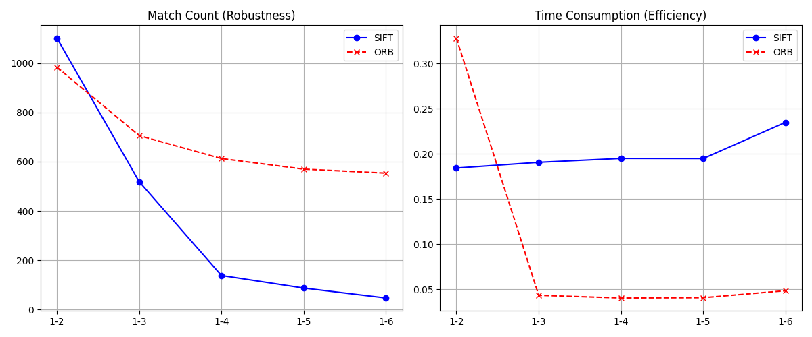
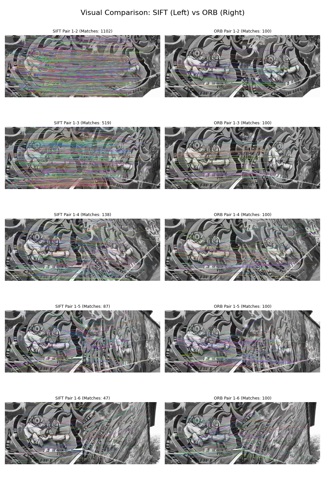

# Report on Feature Extraction

## Introduction

In this assignment, I implemented a feature extraction algorithm using built-in functions from OpenCV.

I compared the differences between two feature extraction algorithms: SIFT and ORB.

## Dataset

I used a set of sample images recommended by Gemini to test the feature extraction algorithms. The images include various objects and scenes to evaluate the performance of the algorithms under different conditions.

The images can be downloaded from the following link: [Sample Images](https://www.robots.ox.ac.uk/~vgg/research/affine/det_eval_files/graf.tar.gz).

Basically, these dataset contains images with different viewpoints, scales, which is suitable for testing feature extraction algorithms.

## Overall Result

The following chart summarizes the performance of SIFT and ORB in terms of keypoints detected and time taken for feature extraction.

In this case, ORB shows better performance in terms of keypoints detected. And it is significantly faster than SIFT, making it more suitable for real-time applications where speed is crucial.

The performance of SIFT is better than ORB in terms of keypoints detected, only when the images are almost the same. Generally, SIFT is slower compared to ORB. When the images are less similar, the number of keypoints detected by SIFT decreases significantly, making it less effective in such scenarios.

Above all, ORB is a more efficient choice for feature extraction in most scenarios, especially when dealing with images that have significant variations.

## Visual Comparison

