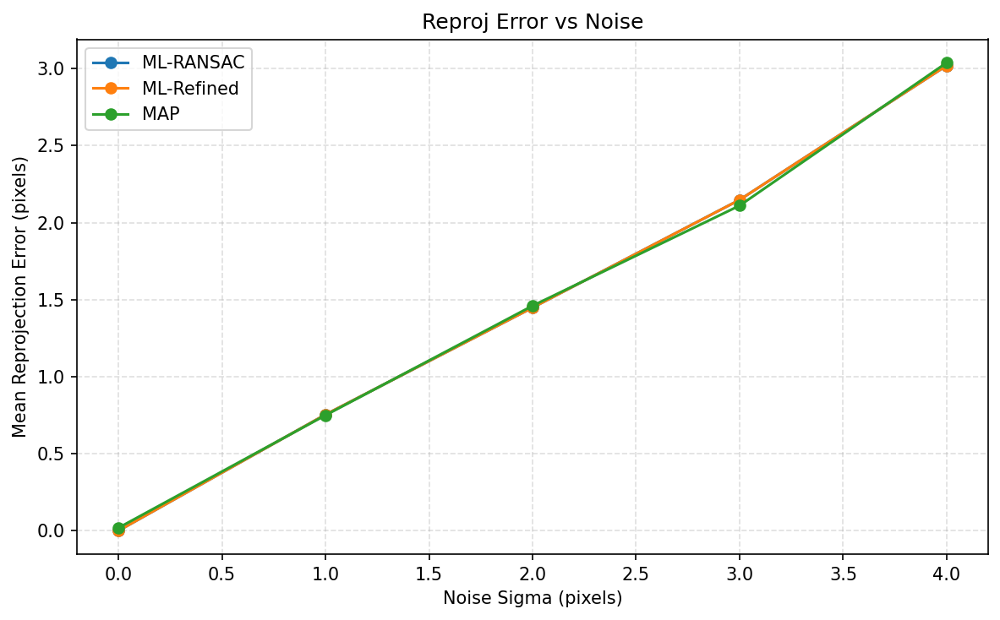
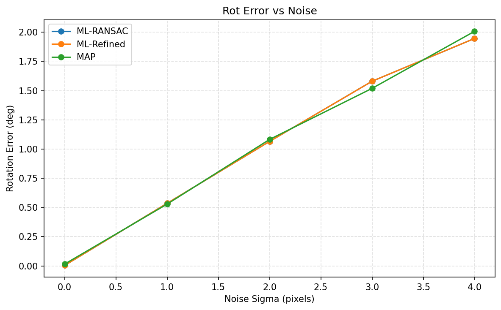
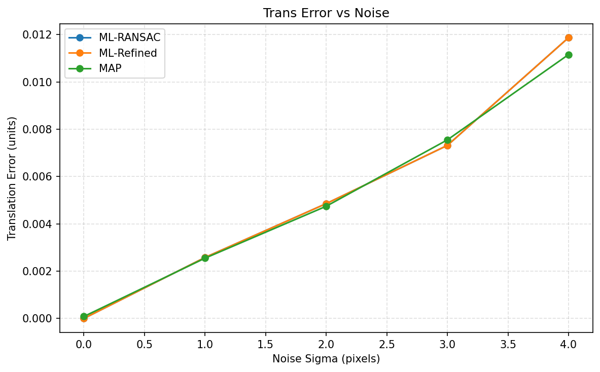
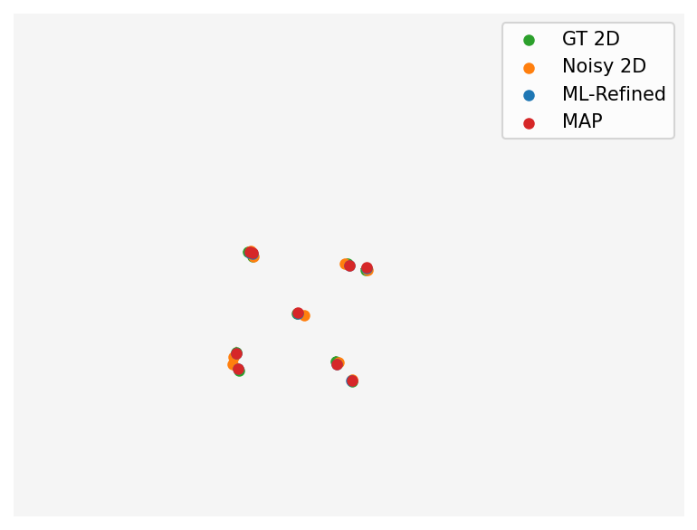

# Assignment 3 Report: Pose Estimation with ML + MAP

## 1. Task Description
The assignment requires:
- implementing **Maximum Likelihood (ML)** and **Bayesian (MAP)** estimation algorithms,
- selecting a **CV/PR application** and dataset,
- using AI tools for algorithm search, coding, and report writing,
- and submitting a report describing the workflow and results.

This project targets **6D pose estimation from 2D-3D keypoint correspondences**.

---

## 2. AI-Assisted Workflow
1. Chose pose estimation as the target application and defined ML/MAP formulations.
2. Designed a compact LINEMOD-style dataset schema and loader.
3. Implemented ML estimation with PnP + RANSAC + iterative refinement.
4. Implemented MAP estimation with a Gaussian prior and Gauss-Newton optimization.
5. Generated plots and visual overlays, then wrote this report.

My own role was to:
- constrain the dataset scope,
- review the code structure and outputs,
- and verify reproducibility settings.

---

## 3. Method Design

### 3.1 Dataset
The dataset follows a LINEMOD-style JSON schema:
```
root/
  images/
    000001.png
    000002.png
  annotations.json
  camera.json  (optional)
```

Each sample stores 2D keypoints, 3D keypoints, and the ground-truth pose:
```json
{
  "image": "images/000001.png",
  "keypoints_2d": [[x1, y1], [x2, y2], ...],
  "keypoints_3d": [[X1, Y1, Z1], [X2, Y2, Z2], ...],
  "pose": {"R": [[...],[...],[...]], "t": [tx, ty, tz]},
  "camera": {"fx": ..., "fy": ..., "cx": ..., "cy": ...}
}
```

For quick runs, a **toy dataset generator** is included.

### 3.2 ML Estimator
ML estimation minimizes the reprojection error under Gaussian noise:
1. `cv2.solvePnPRansac` for robust initialization.
2. `cv2.solvePnP` for iterative refinement.

### 3.3 MAP Estimator
MAP adds a Gaussian pose prior:
```
E_MAP = (1/sigma^2) || reprojection_error ||^2
        + || (pose - mu) / sigma_prior ||^2
```
The prior mean and variance are computed from the training split. A Gauss-Newton solver with damping refines the pose.

---

## 4. Program Pipeline
Main workflow in `assignment_3/main.py`:
1. Generate or load the dataset.
2. Split into train/validation sets.
3. Estimate ML and MAP poses across noise levels.
4. Compute reprojection, rotation, and translation errors.
5. Save plots and visual overlays to `assignment_3/img/`.

---

## 5. Results & Visualizations
**Run configuration (toy dataset):**
- `--generate-toy --data-root data_toy --num-samples 40 --seed 42`
- noise levels: 0, 1, 2, 3, 4 (pixels)

The program outputs the following figures in `assignment_3/img/`:
- `reprojection_error.png`
- `rotation_error.png`
- `translation_error.png`
- `overlay.png`

### Reprojection Error vs Noise


### Rotation Error vs Noise


### Translation Error vs Noise


### Keypoint Overlay Visualization


**Observed trends (from this run):**
- ML-RANSAC and ML-Refined are identical on the toy dataset (the refinement converges to the same solution).
- MAP is competitive with ML and sometimes improves rotation/translation error at higher noise, but not uniformly for all metrics.

---

## 6. Analysis
- The prior reduces pose jitter in noisy conditions.
- MAP performance depends on the prior statistics from training samples.
- Numerical Jacobians make MAP slower than pure ML refinement.

---

## 7. Limitations and Future Work
Limitations:
1. MAP uses numerical Jacobians, increasing computation time.
2. The toy dataset is simpler than real LINEMOD scenes.
3. The prior is a diagonal Gaussian in Rodrigues space.

Future work:
- derive analytic Jacobians or use automatic differentiation,
- evaluate on a real LINEMOD subset with true keypoints,
- compare with learning-based 6D pose methods.

---

## 8. Conclusion
This project delivers a complete **ML + MAP 6D pose estimation pipeline**:
- a LINEMOD-style dataset schema,
- PnP-RANSAC ML estimation with refinement,
- MAP refinement with Gaussian pose priors,
- and evaluation plots with visual overlays.

The framework is lightweight and extensible to real pose datasets.