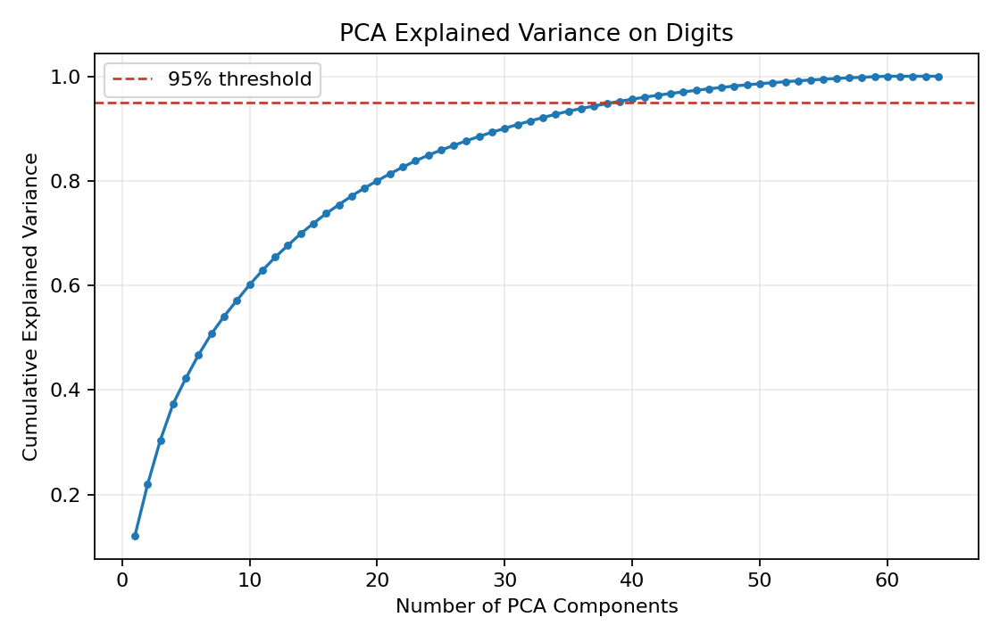
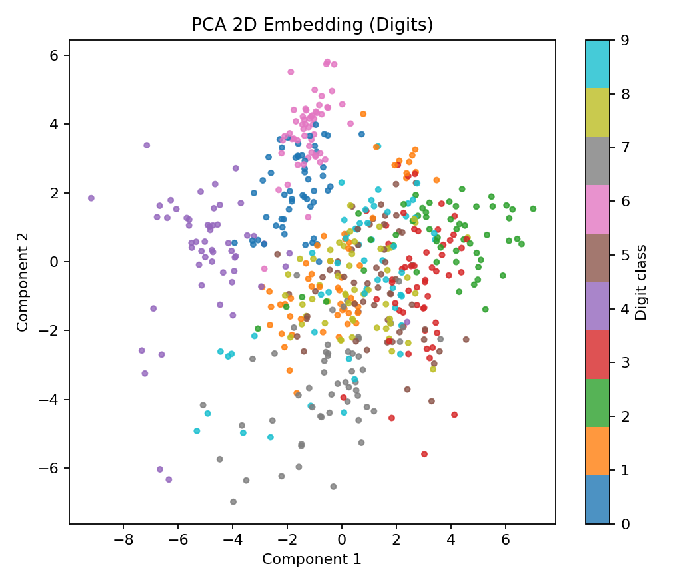
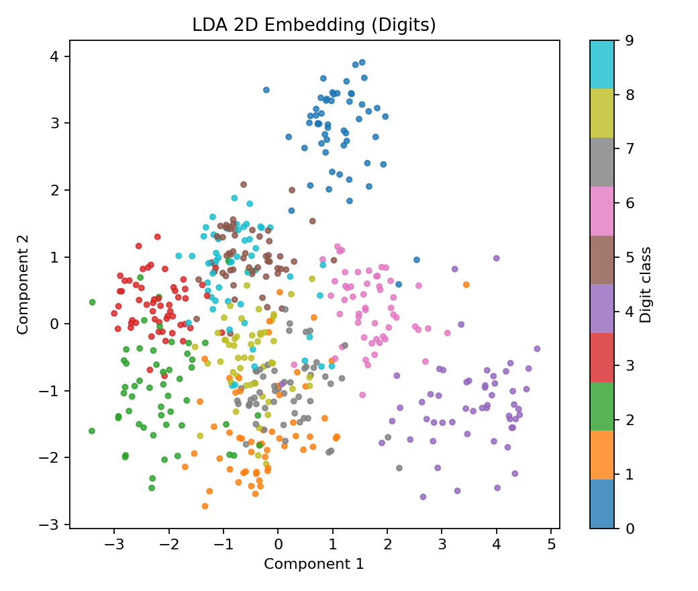
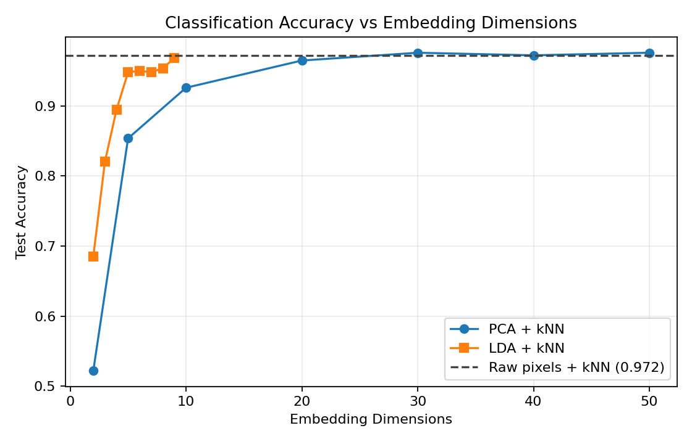
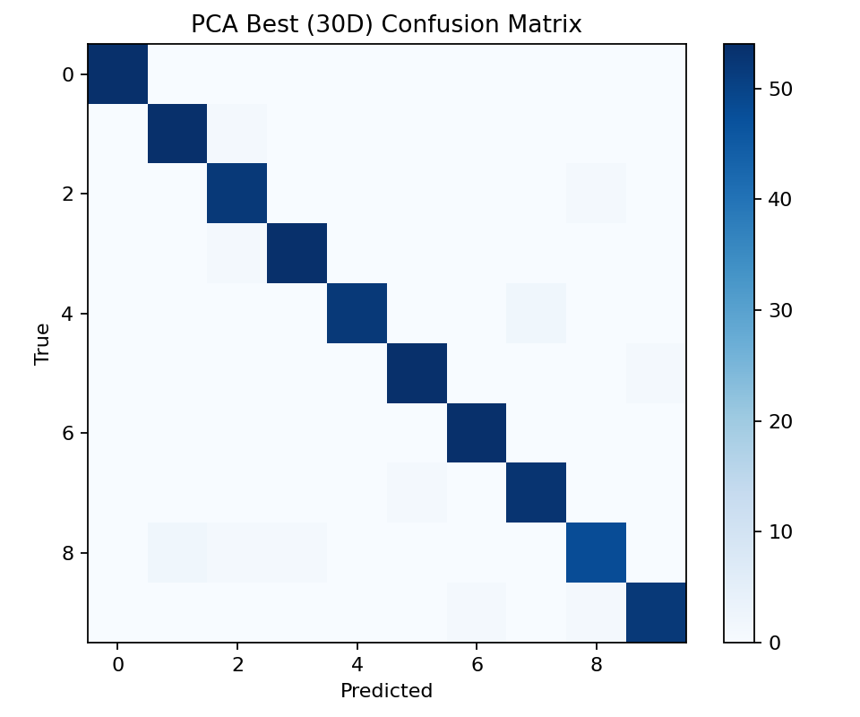
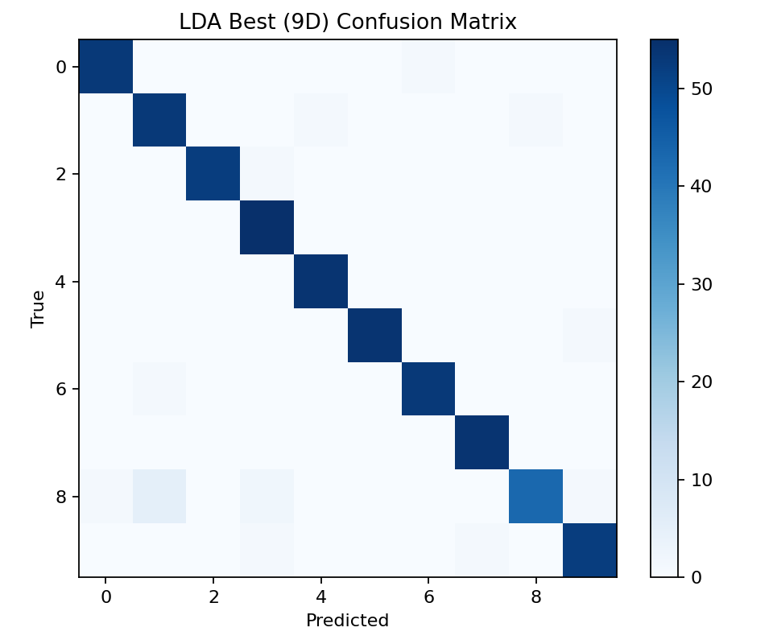
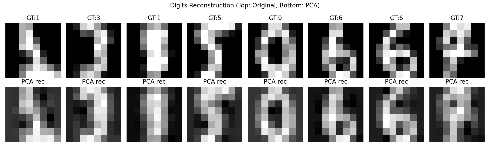

# Assignment 4 Report: PCA and LDA for Computer Vision Pattern Recognition

## 1. Task Goal
This assignment asks for:
- searching and implementing recent PCA and LDA algorithms,
- applying them to a computer vision / pattern recognition task,
- completing the workflow with AI assistance,
- and documenting all steps in a report.

Application selected in this project:
- handwritten digit recognition on a vision dataset,
- dimensionality reduction with PCA/LDA,
- classification in the reduced space with kNN.

## 2. AI-Assisted Workflow (Step-by-step)
1. Read assignment requirements from `assignment_4/README.md`.
2. Use AI to design an end-to-end pipeline for PCA/LDA comparison.
3. Generate implementation in `assignment_4/main.py`:
   - PCA from scratch (SVD-based),
   - LDA from scratch (between/within scatter),
   - visualization and evaluation utilities.
4. Select a standard CV dataset: scikit-learn Digits (8x8 grayscale images, 10 classes).
5. Run experiment in conda environment `pytorch`.
6. Resolve environment issue:
   - NumPy 2.0 caused repeated runtime warnings for matrix multiplications,
   - downgraded to `numpy==1.26.4`, then re-ran successfully.
7. Generate figures and summary metrics in `assignment_4/img/`.
8. Write this report with method details, commands, and result analysis.

## 3. Methods

### 3.1 PCA
Given centered data matrix $X \in \mathbb{R}^{n \times d}$, PCA finds orthogonal directions maximizing variance.

In this implementation:
- center input by subtracting feature mean,
- use SVD: $X = U\Sigma V^T$,
- principal components are top rows of $V^T$,
- projection: $Z = (X - \mu)W^T$.

### 3.2 LDA
LDA seeks projections maximizing class separability:
$$
\max_W \frac{|W^T S_b W|}{|W^T S_w W|}
$$
where $S_w$ is within-class scatter and $S_b$ is between-class scatter.

In this implementation:
- compute class means and global mean,
- construct $S_w$ and $S_b$,
- solve eigen-problem of $S_w^{-1}S_b$,
- keep top eigenvectors as discriminant directions.

### 3.3 Pattern Recognition Setup
- Dataset: Digits, 1797 samples, 64 features per image.
- Split: 70% train / 30% test (stratified, random seed 42).
- Classifier: kNN ($k=3$).
- Compare:
  - raw pixels + kNN,
  - PCA embedding + kNN,
  - LDA embedding + kNN.

## 4. Environment and Execution

### 4.1 Conda Environment
All experiments were run in:
- environment name: `pytorch`

### 4.2 Key Commands
```bash
# run from repository root or assignment_4 folder
conda run -n pytorch python assignment_4/main.py
# or
cd assignment_4
conda run -n pytorch python main.py
```

Environment stabilization used during debugging:
```bash
conda run -n pytorch python -m pip install matplotlib scikit-learn
conda run -n pytorch python -m pip install numpy==1.26.4
```

## 5. Quantitative Results
From `img/results_summary.txt`:
- Baseline kNN accuracy (raw pixels): **0.9722**
- Best PCA setting: **30 dimensions**, accuracy **0.9759**
- Best LDA setting: **9 dimensions**, accuracy **0.9685**
- PCA dimensions for >=95% explained variance: **39**

Interpretation:
- PCA gives a slight improvement over raw-pixel baseline while reducing dimension.
- LDA reaches strong performance with only 9 dimensions, showing compact discriminative representation.

## 6. Visual Results

### 6.1 PCA Explained Variance


### 6.2 2D Embedding Visualization
PCA 2D embedding:


LDA 2D embedding:


### 6.3 Classification Accuracy vs Dimension


### 6.4 Confusion Matrices
Best PCA confusion matrix:


Best LDA confusion matrix:


### 6.5 PCA Reconstruction Example


## 7. Discussion
- PCA preserves global variance structure and provides the best accuracy in this experiment.
- LDA emphasizes class separation and achieves near-best accuracy with far fewer dimensions.
- For compact representation and fast downstream models, LDA is attractive.
- For best overall accuracy on this setup, PCA at 30 dimensions performs best.

## 8. Conclusion
This assignment successfully implemented PCA and LDA with an application in computer vision pattern recognition (digit classification). The full AI-assisted workflow covered requirement analysis, coding, environment setup, experiment execution, figure generation, and report writing. Results show both methods are effective, with PCA yielding the highest accuracy and LDA offering highly compact discriminative features.
