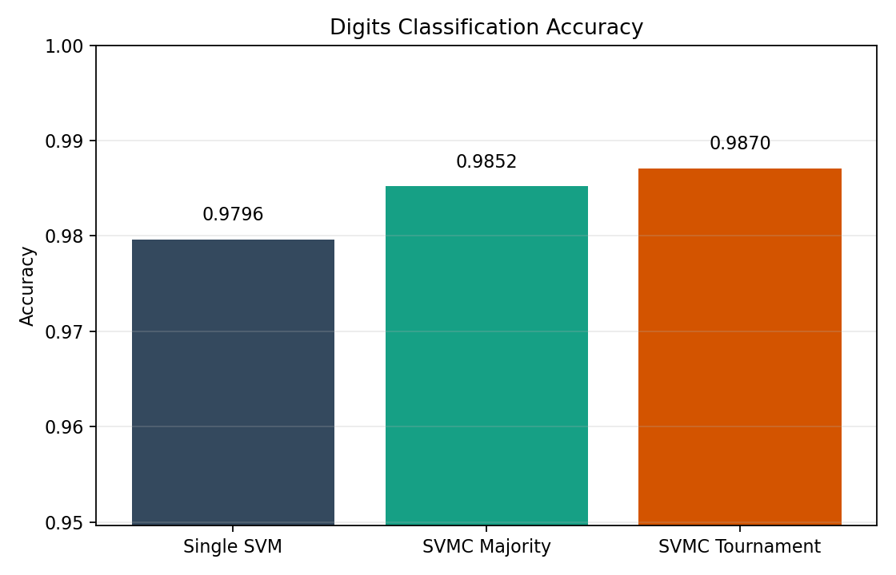
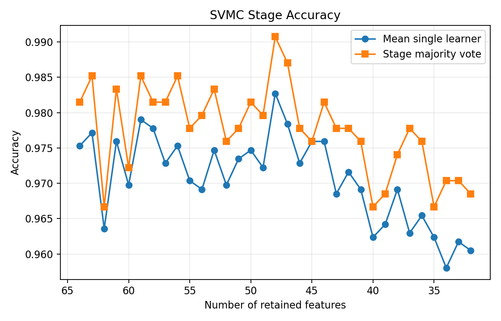
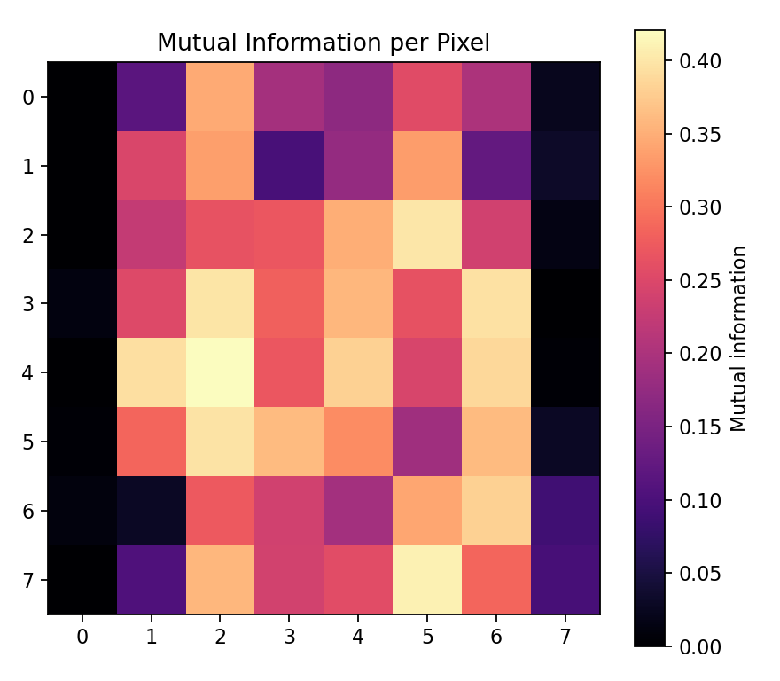
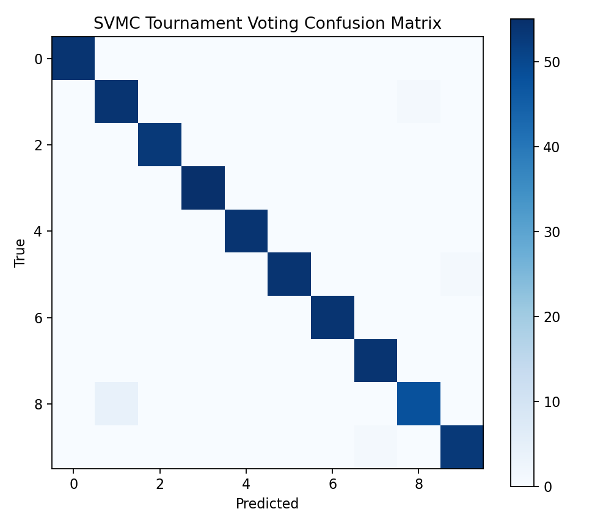
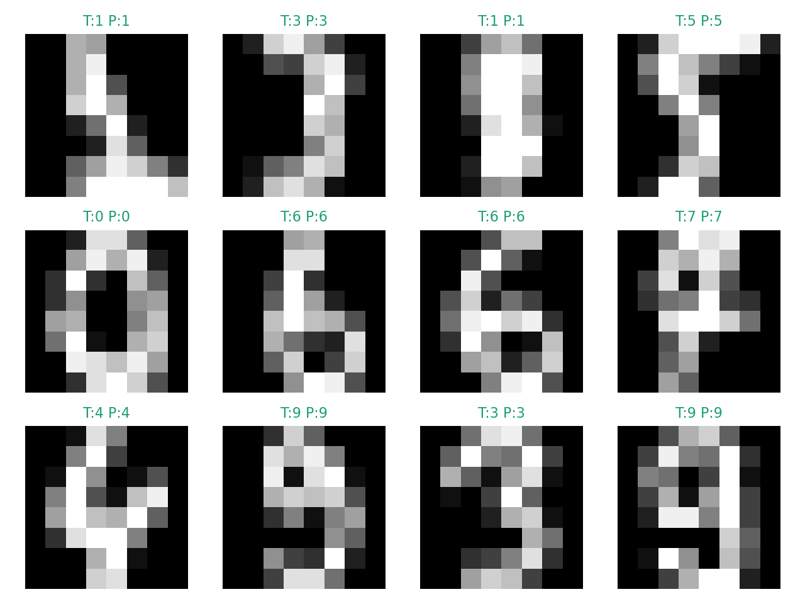

# Assignment 5 Report: Support Vector Machine Chains for Handwritten Digit Recognition

## 1. Task Goal
The assignment asks for:
- finding a recent Support Vector Machine (SVM) algorithm,
- implementing it for a computer vision / pattern recognition task,
- using AI assistance for the workflow,
- and documenting the full process in a report.

For this project, I selected **Support Vector Machine Chains (SVMC)**, a 2023 ensemble-style SVM method, and applied it to **handwritten digit recognition** on the scikit-learn Digits dataset.

## 2. AI-Assisted Workflow
This assignment was completed with AI assistance, as required by the coursework description.

Step-by-step workflow:
1. Read the assignment requirement and identify that the deliverables must include both code and a report.
2. Search for a recent SVM-related paper that is feasible to reproduce in a compact coursework setting.
3. Select the 2023 paper **“Support Vector Machine Chains with a Novel Tournament Voting”** as the target algorithm.
4. Design a reproducible experiment around a standard CV/PR task: handwritten digit classification.
5. Generate the implementation, including:
   - mutual-information feature ranking,
   - chained SVM training with bootstrap resampling,
   - majority voting and tournament voting,
   - evaluation and visualization utilities.
6. Run the experiment locally and save the figures and summary results.
7. Summarize the method, commands, and observed results in this English report.

My role was to:
- provide the assignment objective,
- verify the project structure and outputs,
- and review whether the implementation matches the coursework requirement.

## 3. Selected Recent SVM Algorithm

### 3.1 Paper
The selected recent method is:

**M. Toz, “Support Vector Machine Chains with a Novel Tournament Voting,” Electronics, vol. 12, no. 11, 2023.**

Main idea:
- rank features by mutual information,
- iteratively remove the least informative features,
- train multiple bootstrapped SVM models at each feature level,
- and fuse all predictions using a tournament-style voting rule.

This makes the method more than a single SVM classifier. It combines:
- feature selection,
- ensemble learning,
- bootstrap resampling,
- and a structured voting mechanism.

### 3.2 Why It Fits the Assignment
The paper is recent, the algorithm is still clearly SVM-based, and the method can be reproduced with standard Python tools on a small image dataset. This makes it a good fit for a course assignment that requires both implementation and a report.

## 4. Application in Computer Vision and Pattern Recognition

### 4.1 Task
The application is **image-based handwritten digit recognition**, which is a classic pattern recognition problem.

### 4.2 Dataset
I used the **scikit-learn Digits dataset**:
- 1797 grayscale digit images,
- image size: 8 x 8,
- 10 classes (digits 0 to 9),
- 64 pixel-intensity features per image.

### 4.3 Train/Test Split
- 70% training
- 30% testing
- stratified split
- random seed: 42

## 5. Method Design

### 5.1 Baseline
As a reference, I trained a standard single SVM classifier on all standardized pixel features.

### 5.2 SVMC Implementation
The implementation follows the paper at a compact experimental scale:

1. Compute mutual information scores for all 64 pixel features.
2. Sort features from most informative to least informative.
3. Build a chain of feature subsets:
   - 64 features,
   - 63 features,
   - 62 features,
   - ...
   - down to 32 features.
4. At each stage, create bootstrapped training sets.
5. Train multiple SVM learners on these bootstrapped subsets.
6. Collect all learner predictions for each test image.
7. Aggregate predictions in two ways:
   - majority voting,
   - tournament voting.

### 5.3 Tournament Voting
Tournament voting groups predictions into small groups. Inside each group, the dominant class label advances to the next round. The process repeats until only one final class label remains. In this project, the group size is 3.

### 5.4 Implementation Settings
- SVM kernel: `linear`
- `C = 4.0`
- chain size per stage: `3`
- minimum retained feature ratio: `0.5`
- tournament size: `3`

## 6. Program Outputs
Running the program generates:
- an accuracy comparison chart,
- a stage-wise accuracy curve,
- a mutual-information heatmap,
- a confusion matrix,
- and sample prediction visualizations.

These files show the quantitative performance and qualitative visualization of the SVMC pipeline.

## 7. Results
The final experiment used a 70/30 train-test split with random seed 42.

### 7.1 Quantitative Summary

| Method | Accuracy |
| --- | ---: |
| Single SVM | 0.9796 |
| SVMC + Majority Voting | 0.9852 |
| SVMC + Tournament Voting | 0.9870 |

Additional experimental data:
- Training samples: **1257**
- Test samples: **540**
- Best stage ensemble accuracy: **0.9907**
- Best stage retained features: **48**
- Top-10 mutual-information feature indices: **[34, 61, 21, 26, 42, 30, 33, 38, 36, 54]**

### 7.2 Accuracy Comparison

### 7.3 Stage-wise Accuracy

### 7.4 Mutual Information Heatmap

### 7.5 Confusion Matrix

### 7.6 Sample Predictions

## 8. Analysis
- The SVMC approach improves over a single SVM baseline on this digit-recognition task.
- Feature elimination does not immediately hurt performance; instead, several reduced feature subsets perform slightly better than the full 64-feature input.
- Tournament voting performs slightly better than majority voting in this experiment, which is consistent with the paper’s claim that local competitions can produce a stronger final decision.
- The mutual-information heatmap highlights that the central stroke regions of digit images are more informative than border pixels, which matches intuition for digit recognition.

## 9. Limitations
This coursework implementation still has several limitations:
1. It reproduces the main idea of the paper, but not every experimental detail from the original study.
2. The dataset is relatively small and simple compared with large-scale modern vision benchmarks.
3. Only one kernel setting was used in the final run.
4. No extensive hyperparameter search was performed.

## 10. Conclusion
This assignment delivers a complete AI-assisted implementation of a recent SVM-based algorithm for a vision classification task. The project includes:
- a working SVMC pipeline,
- a standard CV/PR dataset,
- quantitative evaluation,
- visualization outputs,
- and an English report that documents the process.

The results show that the selected recent SVM method is practical and effective for handwritten digit recognition, and that tournament voting slightly improves the final classification accuracy over ordinary majority voting.

## 11. References
1. Toz, M. Support Vector Machine Chains with a Novel Tournament Voting. *Electronics*, 12(11), 2485, 2023.
2. scikit-learn developers. Digits dataset documentation and API reference.
