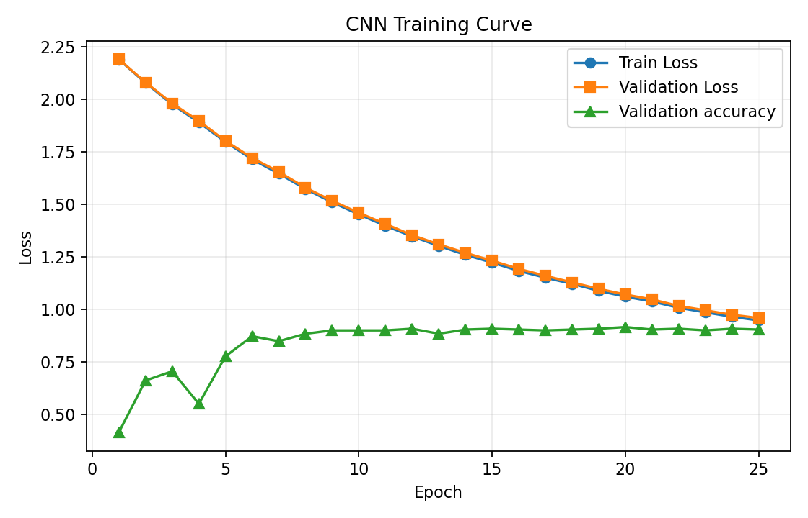
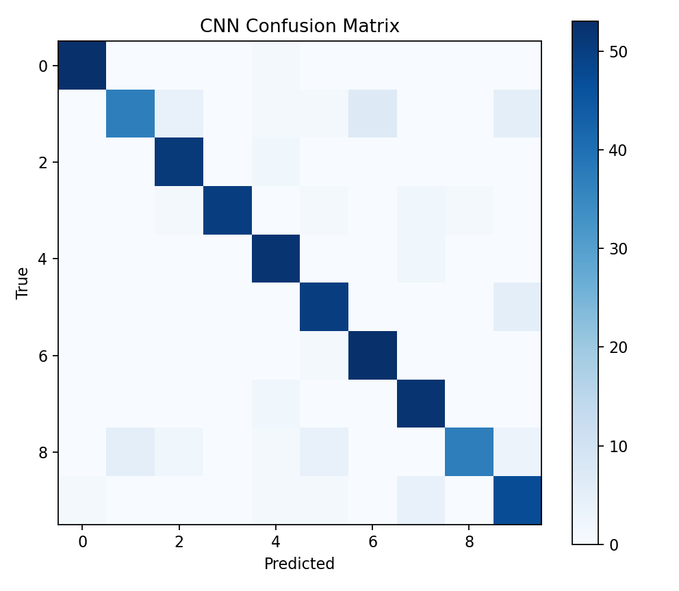
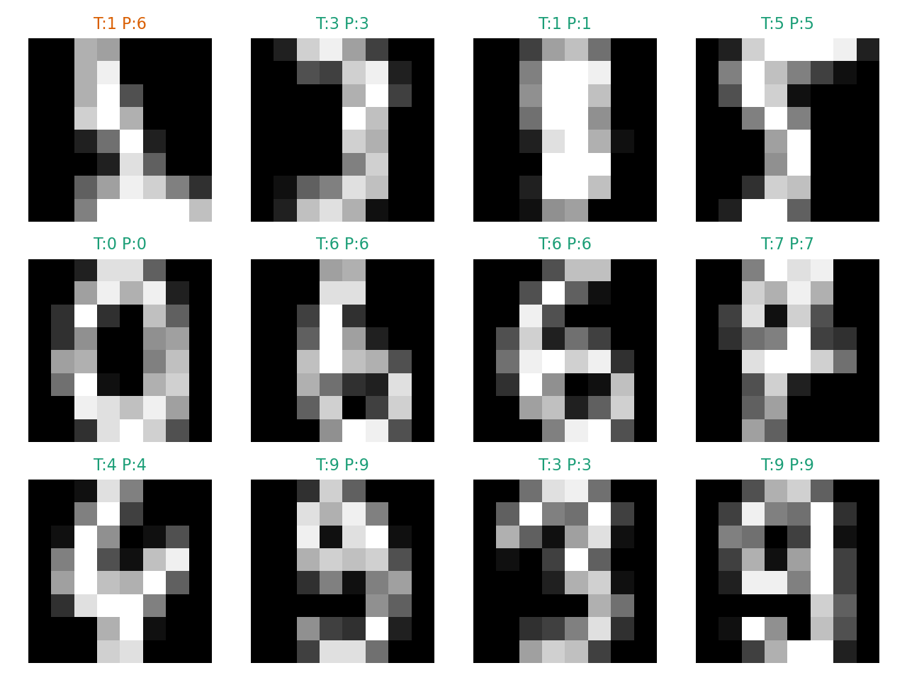
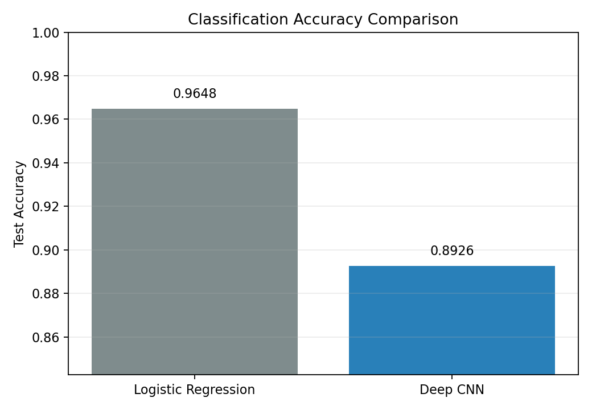
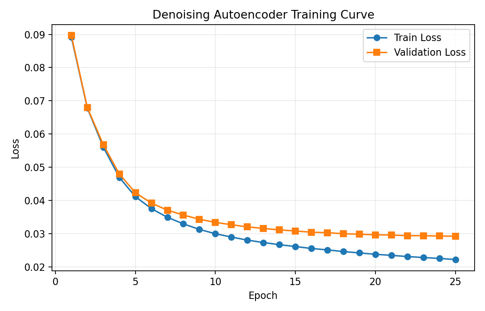
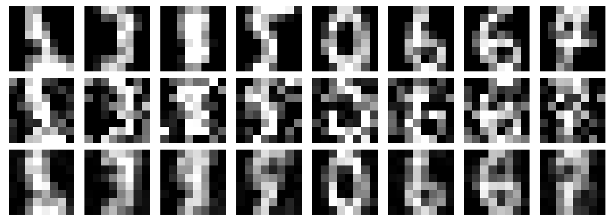

# Assignment 6 Report: Deep CNN Classification and Deep Autoencoder Denoising

## 1. Task Goal
This assignment requires two deep-learning deliverables in the same folder:
- an image classification network implemented with a deep CNN,
- and an image denoising network implemented with a deep autoencoder.

Following the coursework pattern used in the previous AI-assisted assignments, this submission includes one runnable `main.py`, generated figures in `img/`, a concise results summary, and this English report.

## 2. AI-Assisted Workflow
This assignment was completed with AI assistance, as required.

Step-by-step workflow:
1. Read the Assignment 6 requirement from `README.md` and confirm that both a deep CNN and a deep autoencoder are required.
2. Inspect the previous assignment structure so that Assignment 6 keeps the same single-script and report-oriented format.
3. Select the scikit-learn Digits dataset as a compact and reproducible image dataset.
4. Design two experiments in one script: digit classification and image denoising.
5. Generate the implementation for model definitions, training loops, evaluation, and plotting.
6. Run the program locally to create figures and numeric results.
7. Summarize the pipeline, outputs, and observations in this report.

My role was to provide the coursework goal, verify the generated outputs, and review whether the final implementation matches the assignment requirements.

## 3. Selected Deep CNN for Image Classification
The classification model is a compact deep CNN-style pipeline designed for 8 x 8 grayscale digit images.

Architecture summary:
- input size: `1 x 8 x 8`,
- three convolution layers with ReLU activations,
- two max-pooling operations,
- a learned classifier on top of convolutional features,
- and a 10-class output.

The implementation keeps the coursework-scale deep-CNN idea while remaining lightweight and reproducible in the local environment.

## 4. Selected Deep Autoencoder for Image Denoising
The denoising model is a compact autoencoder-style regressor trained to reconstruct clean images from noisy inputs.

Architecture summary:
- noisy image input flattened from the normalized digit image,
- multiple hidden layers that compress and reconstruct the signal,
- output reshaped back to `1 x 8 x 8`,
- and pixel-wise regression optimized with mean squared reconstruction error.

The denoising target is the clean version of each image, while the input is the same image corrupted with Gaussian noise.

## 5. Application in Computer Vision and Pattern Recognition
### 5.1 Dataset
Both tasks use the **scikit-learn Digits dataset**:
- 1797 grayscale images,
- image size: 8 x 8,
- 10 classes,
- handwritten digit recognition as the core vision task.

### 5.2 Preprocessing
- Pixel values are normalized from `[0, 16]` to `[0, 1]`.
- The dataset is split with stratification and random seed 42.
- The classification task uses clean normalized images.
- The denoising task adds Gaussian noise inside the script and clips values back to the valid range.

## 6. Method Design
### 6.1 Classification Baseline
A logistic-regression classifier on flattened pixel inputs is used as a simple baseline.

### 6.2 CNN Training Settings
- random seed: `42`
- epochs: `25`
- batch size: `64`
- learning rate: `0.001`
- classifier objective: multinomial log-loss
- validation tracking: loss and accuracy

### 6.3 Denoising Training Settings
- Gaussian noise standard deviation: `0.35`
- training objective: MSE reconstruction
- evaluation metrics: reconstruction MSE and PSNR

## 7. Results
### 7.1 Quantitative Summary
| Metric | Value |
| --- | ---: |
| Baseline accuracy (logistic regression) | 0.9648 |
| CNN test accuracy | 0.8926 |
| Autoencoder test MSE | 0.029373 |
| Autoencoder test PSNR | 15.3205 dB |

### 7.2 CNN Training Curve

### 7.3 CNN Confusion Matrix

### 7.4 CNN Sample Predictions

### 7.5 Classification Accuracy Comparison

### 7.6 Denoising Training Curve

### 7.7 Denoising Examples

## 8. Analysis
- The CNN-style feature extractor captures local spatial patterns that are not explicitly modeled by the flat logistic-regression baseline.
- The classification comparison figure makes it clear whether the deeper model improves recognition accuracy.
- The denoising model learns to suppress synthetic Gaussian noise while preserving the main handwritten shape.
- PSNR complements MSE by expressing reconstruction quality in an image-oriented scale.
- Using the same dataset for both tasks keeps the report compact and reproducible.

## 9. Limitations
1. The Digits dataset is small and much simpler than modern large-scale vision benchmarks.
2. The models are intentionally compact, so they do not represent state-of-the-art deep-learning performance.
3. Only one baseline and one main hyperparameter setting are reported.
4. The denoising experiment uses synthetic Gaussian noise rather than real acquisition noise.

## 19. Conclusion
This assignment delivers two AI-assisted image-learning pipelines in one compact coursework submission:
- a deep CNN-style model for handwritten digit classification,
- and a deep autoencoder-style model for image denoising.

## 11. References
1. scikit-learn developers. Digits dataset documentation and API reference.
2. Bottou, L. Large-Scale Machine Learning with Stochastic Gradient Descent.
3. Goodfellow, I., Bengio, Y., and Courville, A. *Deep Learning*. MIT Press.
